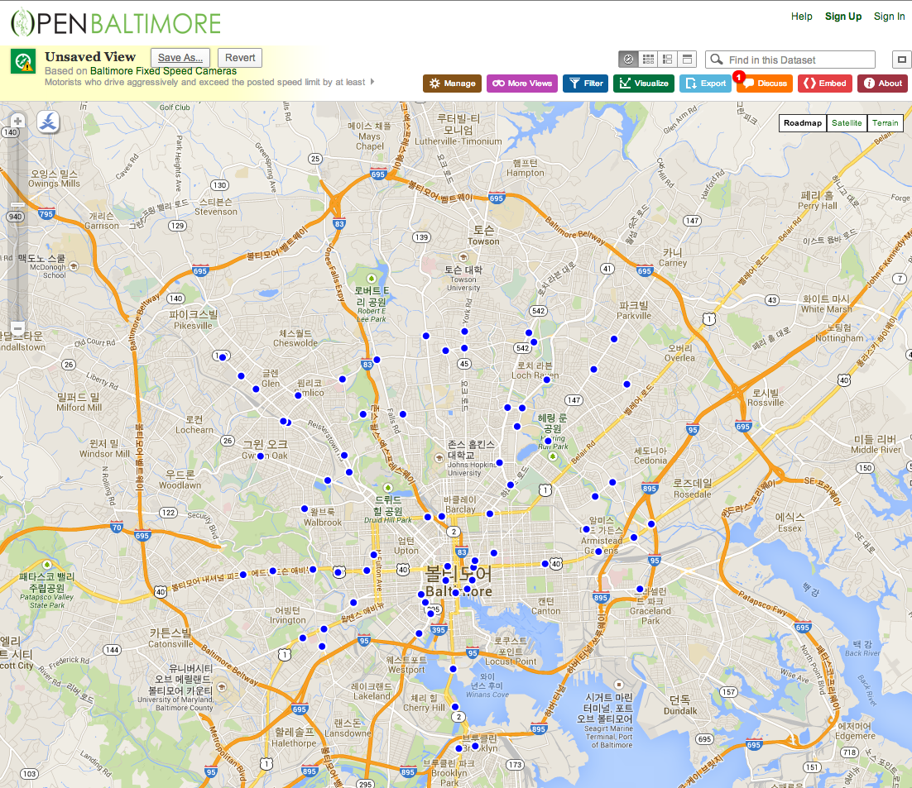

```{r setup, include=FALSE}
knitr::opts_chunk$set(echo = TRUE,comment = NA)
```

# 지난 주 숙제

(문제)
학생 10명이 있다.영어 시험 결과를 eng, 수학 시험 결과를 math라고 하자.
영어시험은 2번과 9번 학생이 결시하였고 9번 학생이 수학시험을 결시하였다. R에서 결측치는 NA이다.

```{r}
번호=1:10
영어=c(70,NA,80,85,90,90,60,55,NA,90)
수학=c(80,73,84,90,95,85,60,50,NA,100)
data=data.frame(번호,영어,수학)
data
```


위의 성적 data를 사용하여 누락된 값을 각 과목의 평균치로 채워 넣으세요.

(힌트) is.na()와 apply()함수를 사용하세요.

(답)

1. x라는 벡터의 결측치를 평균값으로 바꾸어 본다.

```{r}
x=c(70,NA,80,85,90,90,60,55,NA,90)
x[is.na(x)]=mean(x,na.rm=TRUE)
x
```
2. 이것을 replaceNA라는 함수로 만든다.
```{r}
replaceNA=function(x){
    x[is.na(x)]=mean(x,na.rm=TRUE)
    x
}
```

3.이것을 apply함수를 이용하여 열 단위로 적용한다.
```{r}
apply(data,2,replaceNA)
```

# 오늘 다룰 내용

* 패키지 설치,이용
* 인터넷에 있는 자료 읽기
* 엑셀(*.xls), csv(*csv) , SPSS(*.sav)화일 읽기
* 한글데이타 읽기
* 평균 검정 ; t-test, ANOVA, two-way ANOVA, ANCOVA
* mytable()

# CRAN의 이용

R-project 홈페이지

[https://www.r-project.org](https://www.r-project.org)

# CRAN에 있는 패키지의 설치
```{r,eval=FALSE}
install.packages("moonBook")
install.packages(c("ztable","webr"))
```

# Github에 있는 패키지의 설치
```{r,eval=FALSE}
install.packages("devtools")
devtools::install_github("cardiomoon/moonBook")
devtools::install_github("cardiomoon/ztable")
devtools::install_github("cardiomoon/webr")
```

# 패키지 불러오기
```{r}
require(moonBook)  # library(moonBook)
require(ztable)
require(webr)
```


# 인터넷에 있는 자료 읽기

[Baltimore Camera Data](https://data.baltimorecity.gov/Transportation/Baltimore-Fixed-Speed-Cameras/dz54-2aru)


```{r,eval=FALSE}
if (!file.exists("data")) {
    dir.create("data")
}
fileUrl <- "https://data.baltimorecity.gov/api/views/dz54-2aru/rows.csv?accessType=DOWNLOAD"
download.file(fileUrl, destfile = "./data/cameras.csv", method = "curl")
dateDownloaded <- date()
```

# 자료의 읽기 - read.table()

* This is the main function for reading data into R
* Flexible and robust but requires more parameters
* Reads the data into RAM - big data can cause problems
* Important parameters file, header, sep, row.names, nrows
* Related: read.csv(), read.csv2()
* read.csv sets sep="," and header=TRUE

# Example: Baltimore camera data
```{r}
cameraData <- read.table("./data/cameras.csv", sep = ",", header = TRUE)
head(cameraData)
```

# Example: Baltimore camera data

read.csv sets sep="," and header=TRUE

```{r}
cameraData <- read.csv("./data/cameras.csv")
head(cameraData)
```

# Some more important parameters

* quote - you can tell R whether there are any quoted values quote="" means no quotes.
* na.strings - set the character that represents a missing value.
* nrows - how many rows to read of the file (e.g. nrows=10 reads 10 lines).
* skip - number of lines to skip before starting to read

In my experience, the biggest trouble with reading flat files are quotation marks ` or " placed in data values, setting quote="" often resolves these.

# 한글 데이타를 읽을 때 주의점

한글 encoding 은 둘 중의 하나로 되어있다.

* EUC-KR
* UTF-8

한글데이타의 예
```{r}
names=c("김규민","박은혜","서지수")
sex=c("M","F","F")
data=data.frame(이름=names,성별=sex)
data
write.csv(data,"test.csv")
test=read.csv("test.csv",fileEncoding="euc-kr")
test
test=read.csv("test.csv",fileEncoding="utf-8")
test
```


# SPSS 자료 읽기
```{r ,eval=FALSE}
library(foreign)
read.spss("file_name")
```

# 자료를 새로 만들때

## comma seperated file ("*.csv") 로 만들자 !!


# 지난주 복습

```{r}
head(acs,10)
str(acs)
summary(acs)

```

# 데이타 요약; 테이블만들기, 카이제곱,피셔검정
```{r}
table(acs$sex,acs$DM)
result=table(acs$sex,acs$DM)
result
chisq.test(result)
chisq.test(result,correct=FALSE)
fisher.test(result)

#xtabs(도수~가로+세로)
result1=xtabs(~sex+DM,data=acs)
result1
addmargins(result1)
chisq.test(result1)
fisher.test(result1)
```

# p 값이란 무엇인가?

[https://ko.wikipedia.org/wiki/유의_확률](https://ko.wikipedia.org/wiki/유의_확률)

# chisq.test의 해석

[http://r-graph.com:3838/ttest](http://r-graph.com:3838/ttest)


# Yate's correction ?

[https://en.wikipedia.org/wiki/Yates%27s_correction_for_continuity](https://en.wikipedia.org/wiki/Yates%27s_correction_for_continuity)

# 평균의 비교

1) One-sample t-test : 알려져 있는 평균과 비교

2) paired t-test vs Wilcoxon Signed-rank test
    
3) 두 군 간의 평균 비교 : t.test vs Wilcoxon Rank-sum test 

4) 세 군 이상 의 평균비교 : one-way ANOVA vs Kruskall-Wallis test


# One-sample t-test : 알려져 있는 평균과 비교

2006년 조사에 의하면 한국인의 1인 1일 평균 알콜섭취량이 8.1g 이다. 
2008년 대통령 선거로 알코올 섭취량이 달라졌는지 조사하였다.

```{r}
x=c(15.5,11.21,12.67,8.87,12.15,9.88,2.06,14.50,0,4.97)
mean(x)
sd(x)
```

검정 순서 

1) 자료가 정규 분포를 하는지 검정 : shapiro.test()

2) 정규분포 하는 경우 : t.test()

3) 정규분포 하지 않는 경우 : Wilcoxon Signed-rank test

```{r}
shapiro.test(x)
t.test(x,mu=8.1)
```
단측검정의 경우 : 귀무가설 mu > 8.1, 유의수준 99%
```{r}
t.test(x,mu=8.1,conf.level=0.99,alter="greater")

```
# Paired t-test vs Wilcoxon Signed-rank test

쌍을 이룬 두 변수의 차이를 보는 검정

t-test의 가정 : 자료가 정규분포를 한다 

```
검정 순서 

1) 자료가 정규 분포를 하는지 검정(shapiro.test())

2) 정규분포 하는 경우 : t.test

3) 정규분포 하지 않는 경우 : Wilcoxon Signed-rank test
```

```{r}
data(sleep)
sleep
str(sleep)
```

## 데이터 sleep 도움말

```{r}
?sleep
```

A data frame with 20 observations on 3 variables.

[, 1]	extra	numeric	increase in hours of sleep

[, 2]	group	factor	drug given

[, 3]	ID	factor	patient ID

## 정규성 검정
```{r}
with(sleep,
     shapiro.test(extra[group == 2] - extra[group == 1]))
```
정규분포를 따르지 않으므로 wilcoxon test실시
```{r}
with(sleep,
     wilcox.test(extra[group == 2] - extra[group == 1]))
```
비모수방법은 자료의 순서를 이용하는데 동일한 값이 있어 순서를 정하는 데 
문제가 있어 warning생김 : exact=FALSE 옵션을 추가한다
```{r}
with(sleep,
     wilcox.test(extra[group == 2] - extra[group == 1],exact=FALSE))
```

정규분포를 따르는 경우 Student's paired t-test 실시
```{r}
with(sleep,
     t.test(extra[group == 1],
            extra[group == 2], paired = TRUE))
```
약을 1에서 2로 바꾸었을때 수면시간이 늘어나는가? The sleep *prolongations*
```{r}
sleep1 <- with(sleep, extra[group == 2] - extra[group == 1])
summary(sleep1)
stripchart(sleep1, method = "stack", xlab = "hours",
           main = "Sleep prolongation (n = 10)")
boxplot(sleep1, horizontal = TRUE, add = TRUE,
        at = .6, pars = list(boxwex = 0.5, staplewex = 0.25))
```

# t.test의 해석

[http://r-graph.com:3838/ttest](http://r-graph.com:3838/ttest)


# 단정한 데이터(tidy data)


"Happy families are all alike; every unhappy family is unhappy in its own way." –– Leo Tolstoy


"Tidy datasets are all alike, but every messy dataset is messy in its own way." –– Hadley Wickham


## WHO 결핵 데이터 

table 1-table 5는 1999-2000년에 WHO에 보고된 Afghanistan, Brazil, China의 결핵환자수 이다.

```{r, message=FALSE}
library(tidyverse)
table1
table2
table3
table4a # cases
table4b # population
table5
```


# Tidy data - 세 가지 규칙(Three rules)


1. 각 변수는 고유한 열에 위치(Each variable must have its own column)

2. 각 관찰치는 고유한 행에 위치(Each observation must have its own row)

3. 각 수치는 고유한 cell에 위치(Each value must have its own cell)


### Tidy data의 잇점

1.일관성 있는 데이터의 구조

2.변수가 열에 위치하고 있기 때문에 R의 장점인 벡터화된 연산이 가능하다.


=> 데이터 분석에 유용한 구조로 dplyr, ggplot2등 tidyverse 패키지들은 모두 tidy data에서 작동한다.

--

예 1) 인구 만 명당 유병률 
```{r}
table1 %>%
   mutate(rate = cases/population * 10000)
```


---
예 2) 년도별 환자수 총계

```{r}
table1 %>%
    count(year,wt=cases)
```
---
예 3) 년도별 환자수 시각화 

```{r,fig.height=5}
ggplot(table1,aes(year,cases,colour=country)) + 
    geom_point() +
    geom_line()
```

## Spreading 과 Gathering

- 실제 접할 수 있는 대부분의 데이터는 tidy data가 아니다. 그 이유는 크게 두 가지인데 첫째, 대부분의 사람들은 tidy data의 개념이 없으며 둘째, 데이터는 종종 분석 이외에 다른 목적에 맞게 구조화되어 있기 때문이다. 어떤 데이터는 입력하기 쉬운 구조로 되어 있다.  

- 깔끔한 데이타를 만들기 위한 첫번째 단계는 변수와 관측치를 구별하는 일이다. 두번째는 다음과 같은 흔한 문제를 해결하는 것이다.

1. 한 변수가 여러 열에 분산되어 있는 경우

2. 한 관측치가 여러행에 흩어져 있는 경우

=> spread()와 gather()로 해결할 수 있다.


### Gathering


```{r}
table4a
```

table4a의 1999와 2000은 변수의 이름이 아니고 year 변수의 값이고 각 행은 하나의 관측치가 아니라 두개의 관측치이다. 


```{r}
table4a %>%
    gather(`1999`,`2000`,key="year",value="cases")
```

```{r}
table4b 
table4b %>% 
  gather(`1999`, `2000`, key = "year", value = "population")
```

```{r}
tidy4a <- table4a %>% 
  gather(`1999`, `2000`, key = "year", value = "cases")
tidy4b <- table4b %>% 
  gather(`1999`, `2000`, key = "year", value = "population")
left_join(tidy4a, tidy4b)
```

### Spreading

```{r}
table2
```

table2에는 하나의 관측치가 두개의 행에 나누어져 있다. 하나의 관측치는 한 나라, 한 해의 데이터인데 각 관측치가 두 행에 나뉘어져 있다. 이 경우 spread()함수로 데이터를 깔끔한 데이터로 만들 수 있다.


```{r}
table2 %>% spread(key=type,value=count)
```


# long form <-> wide form

학생 10명이 있다. 수업전 test 결과를 pre, 수업후 test결과를 post라고 하자 
```{r}
id=1:10
pre=c(70,72,80,85,90,90,60,55,80,90)
post=c(80,73,84,90,95,85,60,50,84,100)
data=data.frame(id,pre,post)
data
```

이 데이타는 전형적인 wide form이다. 이 데이타를 long form으로 바꾸려면 gather()를 사용한다.


```{r}
require(tidyverse)
longdata=gather(data,key=key,value=value,-id)
longdata
```

long form의 데이타를 wide form의 데이타로 바꾸려면 spread()를 사용한다.
```{r}
widedata=spread(longdata,key,value)
widedata
```


# 두 집단의 평균의 비교 

1) 정규성검정

   - 반응변수가 정규분포 하는 경우 : 모수통계
   - 그외 : 비모수통계

정규분포 하는경우 

2) 분산이 같은지 검정( var.test() )

3) 분산이 다르면 Welch의 t-test 검정(t.test())

4) 분산이 같으면 pooled variance를 이용한 t-test (var.equal=TRUE)


### 반응변수의 정규성 검정 : 
선형모형에 적합시킨후 잔차가 정규분포하는지 검정

```{r}
model=lm(age~sex,data=acs)
shapiro.test(resid(model))
```


```{r}
result=aggregate(age~sex,data=acs,function(x) { c(mean(x),sd(x))})
colnames(result$age)=c("mean","sd")
result
boxplot(age~sex,data=acs)

# 분산이 같은지 F 검정
var.test(age~sex,data=acs)
require(webr)
plot(var.test(age~sex,data=acs))
# 분산이 같으므로 var.equal=TRUE로 검정
result=t.test(age~sex,data=acs,var.equal=TRUE)
result
plot(result)
# 분산이 다르다면 var.equal=FALSE로 검정
t.test(age~sex,data=acs,var.equal=FALSE)

# 비모수검정
wilcox.test(age~sex,data=acs)
```

# 일원분산분석 (One-way ANOVA)

```{r}
aggregate(mpg~cyl,data=mtcars,mean)
boxplot(mpg~cyl,data=mtcars)
# cyl가 numeric이므로 factor변수로 바꾸어준다
mtcars$group=factor(mtcars$cyl)
out=lm(mpg~group,data=mtcars)
out
anova(out)
par(mfrow=c(2,2))
plot(out)
par(mfrow=c(1,1))
```
# 다중비교
```{r}
#install.packages("multcomp")
library(multcomp)
tukey=glht(out,linfct=mcp(group="Tukey"))
summary(tukey)
plot(tukey)
```

# 비모수검정 : Kruskal-Wallis rank sum test
```{r}
kruskal.test(mpg~group,data=mtcars)
```

# 이원분산분석(Two-way ANOVA)
```{r}
boxplot(mpg~group+am,data=mtcars)
boxplot(mpg~am+group,data=mtcars)
with(mtcars,interaction.plot(cyl,am,mpg))
with(mtcars,interaction.plot(am,cyl,mpg))
out=lm(mpg~group+am,data=mtcars)
summary(out)
```

# 공분산분석 (ANCOVA)
```{r}
plot(mpg~wt,data=mtcars,col=cyl)
legend("topright",legend=c("4","6","8"),pch=1,col=mtcars$cyl)
out=lm(mpg~wt+group,data=mtcars)
anova(out)
summary(out)
dunnett=glht(out,linfct=mcp(group="Dunnett"))
summary(dunnett)
library(lattice)
xyplot(mpg~wt|cyl,data=mtcars)
xyplot(mpg~wt|am,data=mtcars)
```

# moonBook package 이용

그룹간의 비교를 한번에 : moonBook 패키지의 이용

```{r}
library(moonBook)
library(ztable)
str(acs)
```

# mytable

```{r}
mytable(sex~age+DM,data=acs)
mytable(sex~.,data=acs)
mytable(sex~.-smoking,data=acs)
res=mytable(Dx~.,data=acs)
res
```

# group변수를 중첩하여 사용
```{r}
mytable(Dx+sex~.,data=acs)
```

# ztable과의 연동
```{r,results='asis'}
z=ztable(res)
print(z,type="html")
```