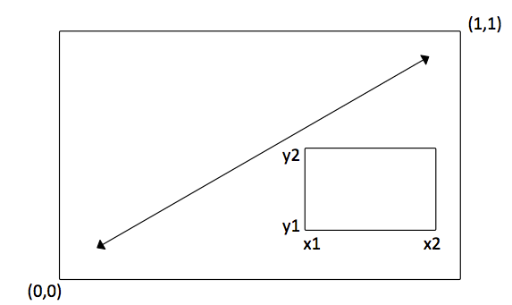

   

```{r setup, include=FALSE}
knitr::opts_chunk$set(echo = TRUE,comment = NA)
```


# R 그래프를 그릴때 알아야 할 점

R의 가장 큰 강점은 그래프이다. 그래프는 용도에 따라 탐색적자료분석에 쓰이는 단순하고 멋 없는 그래프와 논문인쇄에 쓰이는 출판용 그래프로 나누어볼 수 있겠다.

먼저 R에 포함되어 있는 기본적인 그래프를 살펴보고 lattice 그래픽과 ggplot2 그래픽에 대한 소개를 하고자 한다.

## 그래프를 그리는 순서

1. 그래프를 그릴 자료를 준비한다
2. 고수준 그래프함수로 그래프를 그린다.
3. 저수준 함수로 그래프를 장식한다
4. 화일로 저장한다.

# 그래픽스 함수

그래프를 그리는 명령어 는 함수로 되어 있다. 함수를 호출하는 것이 그래프를 그리는 명령어이다. 이 함수는 고수준 함수와 저수준 함수로 되어 있다.

## 고수준 함수란? 저수준함수란? 

자동차의 종류를 예를 들면 사람이 타는 승용차, 비포장길을 다니는 SUV, 화물을 실는 화물차 등이 있다. 이런 차의 종류를 뭉뚱그려 자동차라고 할 수 있다. 
고수준 함수는 완성차와 같다. 고수준함수를 호출하면 현재 그래픽스창을 초기화 하고 새로운 그래프를 그린다. 제목과 장식등을 넣을 수도 있다. 하지만 경우에 따라 옵션을 추가한다던가 튜닝이 필요할 수 있다. 이런 역할을 하는 것이 저수준함수이다.

고수준 함수의 예는 plot, xyplot, boxplot, hist, coplot 등이 있다.

## 다형성이란 ?   

그래프를 그리는 R의 기본 함수는 plot이다. 이것은 자동차와 같다. R의 plot함수는 다형성(ploymorphism)이 있다. 사람을 생각면서 자동차를 부르면 승용차가 나오고 화물을 생각하면서 자동차를 부르면 화물차가 나오는 식이다. plot함수에 무엇을 넘겨주느냐에 따라 xyplot이 나오기도 하고 boxplot이 나오기도 한다. 

```{r}
tail(mtcars)
plot(mtcars)
plot(mpg~disp, data=mtcars)
plot(mpg~ factor(am),data=mtcars)
coplot(mpg~disp | factor(am),data=mtcars)
```

기본으로 점플롯이 만들어지지만(type="p") 선플롯(type="l")이나 점과 선으로된 플롯 (type="b")등을 선택할 수도 있다.
```{r}
par(mfrow=c(1,3))
plot(1:10)
plot(1:10,type="l")
plot(1:10,type="b")
par(mfrow=c(1,1))
```

점모양은 pch로 지정한다.(25가지), 점 크기는 cex로 조절한다
```{r,warning=FALSE,fig.height=6}
x=rep(1:5,each=5);x
y=rep(5:1,5);y
plot(1:5,type="n",xlim=c(0,7.5),ylim=c(0,5.5))
points(x,y,pch=1:25,cex=2)
text(x-0.5,y,labels=as.character(1:25),cex=1.5)
points(rep(6,5),5:1,pch=65:69,cex=2)
text(rep(6,5)-0.5,5:1,labels=as.character(65:69),cex=1.5)
pchs=c("&","z","M","F","가")
points(rep(7,5),5:1,pch=pchs,cex=2,family="AppleGothic")
text(rep(7,5)-0.5,5:1,labels=pchs,cex=1.5,family="AppleGothic")
```

### 기본 옵션을 선택하는 방법

그래프의 가장 기본적인 옵션은 제목, x축과 y축의 범위, 축이름, 색깔등이다. 
다음 두 그래프를 비교해 보면

```{r,warning=FALSE,fig.height=6}
plot(mpg~disp,data=mtcars)
plot(mpg~disp,data=mtcars,pch=21,col="black",bg=mtcars$am+2,cex=1.2,
     main="연비와 배기량",
     xlab="배기량(cu.in)",ylab="연비(mile per gallon)",
     xlim=c(0,500),ylim=c(0,40),family="AppleGothic")
```

## 저수준 함수란? 

저수준 함수는 새로운 그래프를 시작하는 것이 아니라 기존에 있는 그래프에 점,선, 텍스트 장식, 범례 등을 추가로 그리는 함수 이다.예를 들어 다음과 같은 것들이 있다.

### points 점을 추가한다.
### lines 선을 추가한다
### abline 직선을 추가한다
### segment 선분을 추가한다
### ploygon 닫힌 다각형을 추가한다
### text, mtext 텍스트를 추가한다. 
### legend 범례를 추가한다.

```{r,warning=FALSE,fig.height=6}
plot(mpg~disp,data=mtcars,pch=21,col="black",bg=mtcars$am+2,cex=1.2,
     main="연비와 배기량",
     xlab="배기량(cu.in)",ylab="연비(mile per gallon)",
     xlim=c(0,500),ylim=c(0,40),family="AppleGothic")
legend("topright",legend=c("automatic","manual"),pch=21,col="black",pt.bg=2:3,
       cex=1.2)
text(100,10,"피타고라스의 정리",family="AppleGothic")
text(100,7,labels=expression(italic(c^2==a^2+b^2)))
polygon(c(200,300,300),c(5,10,5))
polygon(c(290,290,300,300),c(5,6,6,5))
text(240,8.2,"c")
text(260,4,"a")
text(320,7.5,"b")
abline(h=20,col="green")
abline(v=400,col="blue")
out=lm(mpg~disp,data=mtcars)
abline(out,col="red",lwd=2,lty="dotted")
arrows(200,30,300,35,angle=30)
title(sub="subtitle")
mtext(side=1,line=2,"mtext,side=1,line=2")
mtext(side=2,line=2,"mtext,side=2,line=2")
mtext(side=3,line=0.5,"mtext,side=3,line=0.5")
```

# 모자이크플롯(mosaicplot)

```{r}
result=table(mtcars$cyl,mtcars$am)
result
plot(result,col=c("tan1","firebrick2")) 
```

## 가로세로 바꾸기

```{r}
t(result)
plot(t(result),col=rainbow(3)) 
```

## R에서 사용할 수 있는 색깔 : 

```{r,eval=FALSE}
colors()
demo("colors")
```

# 막대그래프
```{r}
barplot(result)
```
범례 추가
```{r}
barplot(result,legend=rownames(result),ylim=c(0,20))
```

옆으로 나란히 
```{r}
barplot(result,beside=TRUE)
```

수평 막대 그래프
```{r}
barplot(result,beside=TRUE,horiz=TRUE)
```

# spineplot()

acs환자에서 성별에 따른 고혈압 유병률의 차이를 보려면 다음과 같이 할수 있다. 
```{r}
require(moonBook)

result=table(acs$sex,acs$HBP)
result
plot(result,main="mosaicplot")
par(mfrow=c(1,2))
barplot(result,main="Stacked bar plot")
spineplot(result,main="Spineplot")
par(mfrow=c(1,1))
prop.table(result)
prop.table(result)*100
res=addmargins(prop.table(result)*100)
round(res,1)
```

# 그래프의 중첩

방법 1 : 고수준 그래픽함수에서 add=TRUE 옵션을 사용한다.

```{r}
plot(sin,-pi,pi,ylab="y")
plot(cos,-pi,pi,add=T,lty="dotted",col="red")
legend(0,-0.5,legend=c("sin","cos"),lty=1:2,col=1:2)
```

방법 2 : par(new=TRUE)를 이용한다.

```{r}
F = function(x,a) {1/(1+exp(-a-x))}
curve(F(x,-1),col=1,xlim=c(-5,5),ylim=c(0,1),ylab="f(x)")
par(new=TRUE)
curve(F(x,1),col=2,xlim=c(-5,5),ylim=c(0,1),ylab="",axes=FALSE,lty=2)
title(main=expression(f(x)==frac(1,1+exp(-a-x))))
legend(2,0.4,legend=c("a=-1","a=1"),lty=1:2,col=1:2)
```


# 그래프의 저장 : 지정된 크기/형식의 화일로 저장할때 

```{r}
help(Devices)
```
bmp(),jpeg(),png(),pdf(),tiff(),pictex()등을 이용할수 있다.

```{r,eval=FALSE}
png(filename="myplot1.png",width=480,height=480,units="px")
plot(mpg~disp,data=mtcars)
dev.off()
```
화일의 크기 조절은 units로 하는데 "px"(default),"in"(inches),"cm","mm"사용가능 

# 화면의 분할

## 여러 개의 그래프를 하나에 그리기(Combining Graphs)

R에서는 여러 개의 그래프를 합쳐서 하나로 그리기 쉬운데 par() 또는 layout() 함수를 사용한다. 

먼저 par()함수를 사용할 때는 인수인 mfrow=c(nrows,ncols)를 사용하여 nrows*ncols개의 plot으로 분할하는데 그림이 그려지는 순서는 열(row)에 의해 채워진다. mfcol=c(nrows,ncols)를 사용해도 비슷한데 이때는 행(column)을 기준으로 채워진다.

1. 네개의 그래프를 2*2로 배열하기

예를 들어 다음의 코드는 네개의 plot을 만들고 두열과 두행으로 배열한다. 내장 데이타인 mtcars를 사용한다. 
```{r}
attach(mtcars)
#현재 상태를 opar에 저장한다 
opar <- par(no.readonly = TRUE)
# 화면을 2*2로 나눈다
par(mfrow = c(2, 2))
plot(wt, mpg, main = "Scatterplot of wt vs. mpg")
plot(wt, disp, main = "Scatterplot of wt vs disp")
hist(wt, main = "Histogram of wt")
boxplot(wt, main = "Boxplot of wt")
#다시 opar 상태로 되돌린다.
par(opar)
detach(mtcars)
```

2. 두번째 예는 세개의 그래프를 세 행과 한 열로 배열해 본다.

```{r}
attach(mtcars)
opar <- par(no.readonly = TRUE)
par(mfrow = c(3, 1))
hist(wt)
hist(mpg)
hist(disp)
par(opar)
detach(mtcars)
```

고수준 함수인 hist()는 디폴트 타이틀이 포함되는데 제목을 나오지 않게 하려면 main= ""을 사용하거나 ann=FALSE를 사용하여 제목과 label 을 나오지 않게 할수 있다.

3.열 또는 행 마다 그림 갯수를 달리할때

layout함수는 layout(mat)와 같은 형식으로 사용하는데 mat는  matrix object로써 여러 plot의 위치를 나타낸다. 다음 코드에서는 하나의 그림이 1열에 배치되고 두개의 그림은 2열에 배치된다.

```{r}
attach(mtcars)
layout(matrix(c(1, 1, 2, 3), 2, 2, byrow = TRUE))
hist(wt)
hist(mpg)
hist(disp)
detach(mtcars)
```

4.세밀한 그림 크기의 조절

경우에 따라 각 그림의 크기를 보다 정밀하게 조절하고 싶다면 layout() 함수의 옵션인 width=  와 height= 옵션을 사용할 수 있다. 다음과 같이 사용한다.

* width=각 행의 넓이의 값을 갖는 벡터
* height= 각 열의 높이의 값을 갖는 벡터

상대적인 width는 숫자로 표현되며 절대적인 width는(cm) 1cm()함수를 사용하여 표시한다.
다음의 코드에서 한개의 그림은 1열에 두개의 그림은 2열에 배치되지만 1열의 그림의 높이는 2열 높이의 1/3이며 아래열우측의 그림의 넓이는 아래열좌측 그림 넓이의 1/4이 된다.

```{r}
attach(mtcars)
layout(matrix(c(1, 1, 2, 3), 2, 2, byrow = TRUE), 
    widths = c(3, 1), heights = c(1, 2))
hist(wt)
hist(mpg)
hist(disp)
detach(mtcars)
```
보는 것과 같이 layout()함수를 사용하면 최종 이미지 내의 그래프의 수와 배열, 그리고 상대적인 크기까지 조절할 수 있다. 보다 자세한 내용은 help(layout)을 이용해 보라. 

5. 그림 배열의 미세 조절

경우에 따라 하나의 의미있는 그래프를 만들기 위해 여러개의 그림을 배열하거나 겹쳐서 그려야 할 경우가 있다. 그러기 위해서는 그림 배치의 미세 조절이 필요한데  fig=라는 그래픽인수를 사용하면 가능하다. 다음의 코드에서는 scatterplot 에 두개의 boxplot를 더해서 전체 그림을 완성했다. 그림 3.18에 그 결과가 있다.
```{r}
opar <- par(no.readonly = TRUE)
par(fig = c(0, 0.8, 0, 0.8))      # Set up scatter plot
plot(mtcars$wt, mtcars$mpg, xlab = "Miles Per Gallon", 
    ylab = "Car Weight")
par(fig = c(0, 0.8, 0.55, 1), new = TRUE)        # Add box plot above
boxplot(mtcars$wt, horizontal = TRUE, axes = FALSE)
par(fig = c(0.65, 1, 0, 0.8), new = TRUE)        # Add box plot to right
boxplot(mtcars$mpg, axes = FALSE)
mtext("Enhanced Scatterplot", side = 3, outer = TRUE, 
    line = -3)
par(opar)
```
이 그래프가 어떻게 만들어졌는지 이해하기 위해서는 전체 그래프의 왼쪽-아래코너를 (0,0)으로 생각하고 오른쪽-위를 (1,1)로 생각하자. 아래그림을 보면 이해에 도움이 될 것이다. fig=인수의 형식은 c(x1,x2,y1,y2) 형태의 숫자 벡터이다. 



위의코드 중 두번째 줄을 보면 fig=인수는 scatter plot 그래프를 화면 왼쪽 아래를 기준으로 x축위치는 0에서 0.8, y축위치도 0에서 0.8로 지정한다. 위쪽의 boxplot은 가로 위치는 0에서 0.8이고 세로 위치는 0.55에서 1이다. 오른쪽의 boxplot은 x축의 위치는 0.65에서 1이고 y축에서의 위치는 0에서 0.8이다. 

이 그림을 그릴때 위쪽의 boxplt을 그릴때 0.8 대신 0.55를 사용한 이유는 boxplot이 scatterplot에 좀더 가깝게 하기 위해서이다. 마찬가지로 오른쪽 boxplot을 그릴떄에도 0.8이 아닌 0.65를 사용했다. 올바른 위치를 얻기 위해서는 여러번 숫자를 바꿔가며 실험해보라


# 퀴즈: 튀어나와 보이는 barplot

다음과 같은 데이터가 있다. 

``` {r}
blue=rbind(c(5,3,4,3),
           c(3,2,5,1))
dimnames(blue)<-list(c("A","B"),c("t1","t2","t3","t4"))
red=rbind(c(1.7,3.5,1.6,1.1),
          c(2.1,1.0,1.7,0.5))
dimnames(red)<-list(c("A","B"),c("t1","t2","t3","t4"))
blue
red
```


이 자료를 가지고 barplot을 그려본다.

```{r,fig.height=7,fig.show='hold'}
par(mfrow=c(1,2))
barplot(blue,col=c("lightblue","blue"),ylim=c(0,10))
barplot(red,col=c("salmon","red"),ylim=c(0,10))
par(mfrow=c(1,1))
```


## 오늘의 숙제

여기서 문제이다. 이 두개의 그래프를 겹치게 그려 blue에 비해 red가 튀어나와 보이는 그래프를 그리려면 어떻게 해야 할까? 


```{r,echo=FALSE,fig.height=7}
barplot(blue,col=c("lightblue","blue"),ylim=c(0,10),xlim=c(0,9),
        space=c(0,1,1,1),axisnames=FALSE)
barplot(red,col=c("salmon","red"),ylim=c(0,10),axes=FALSE,
        space=c(0.5,1,1,1),add=TRUE)
```


## Lattice Graphics

Lattice package는 Trellis그래픽을 R로 구현한 것이다. 이 그래프는 패널이라는 여러개의 독립된 단위 그래프를 가로, 세로 혹은 페이지의 배열로 나타내서 비교분석한다. 다변량 데이타에서 변수들 간의 유기적인 관계나 특징을 파악할 수 있는 유용한 도구라 할수 있다.

barley 데이타는 1930년대에 미국에서 시행된 유명한 보리경작 실험 데이타이다.
```{r}
library(lattice)
tail(barley)
aggregate(yield~year+variety,data=barley,mean)
barchart(yield~year|variety,data=barley)
```

```{r}
dotplot(variety~yield|site,data=barley,groups=year,
        key=simpleKey(levels(barley$year),space="right"))
```


붓꽃 데이타를 품종에 따라 그래프를 그려보면 다음과 같다.
```{r}
plot(Sepal.Length~Petal.Length,data=iris)
plot(Sepal.Length~Petal.Length,data=iris,col=Species)
xyplot(Sepal.Length~Petal.Length|Species,data=iris)
```


## ggplot2

[http://rpubs.com/cardiomoon/117769](http://rpubs.com/cardiomoon/117769)


## ggplotAssist

[https://github.com/cardiomoon/ggplotAssist](https://github.com/cardiomoon/ggplotAssist)


## 예제

다음 그림을 그려보세요

```{r}
library(ggplot2)
library(car)
# 사용하는 데이터 : car::Salaries
```
```{r,echo=FALSE}
p <- ggplot(data=Salaries,                                 # 데이타 할당 
            aes(x=yrs.service,y=salary,fill=sex))        # 변수 할당
p + geom_point(pch=21) +                            # 점그래프 추가
     geom_smooth(method="lm",formula=y~poly(x,2))   # 회귀선 추가

ggplot(data=Salaries,                                 # 데이타 할당 
            aes(x=sex,fill=rank))+        # 변수 할당
      geom_bar(position="fill")

ggplot(data=Salaries,aes(x=rank,y=salary,fill=rank))+ 
     geom_violin(trim=FALSE)+ 
     geom_boxplot(fill='darkred',width=0.1)+ 
     stat_summary(geom='point',fun.y=mean,shape=23,size=3)+ 
     geom_point(position='jitter')+ 
     scale_fill_brewer(palette='Pastel2')+ 
     theme(legend.position='none')
```


사용하는 데이터  car::Salaries

```{r,echo=FALSE}
ggplot(data=lattice::singer,aes(x=height,fill=voice.part))+ 
     geom_density()+ 
     facet_grid(voice.part ~ .)+ 
     ggtitle("Singer's Height")
```


사용하는 데이터 gccokbook::uspopage

```{r,echo=FALSE}
require(gcookbook)
ggplot(uspopage,aes(x=Year,y=Thousands,fill=AgeGroup))+ 
     geom_area(size=0.2,alpha=0.4) +
     geom_line(position='stack',size=0.2)+ 
     scale_fill_brewer(palette="Blues")
```


## 다중회귀 모형에서의 상호작용의 시각화

[http://rpubs.com/cardiomoon/153265](http://rpubs.com/cardiomoon/153265)