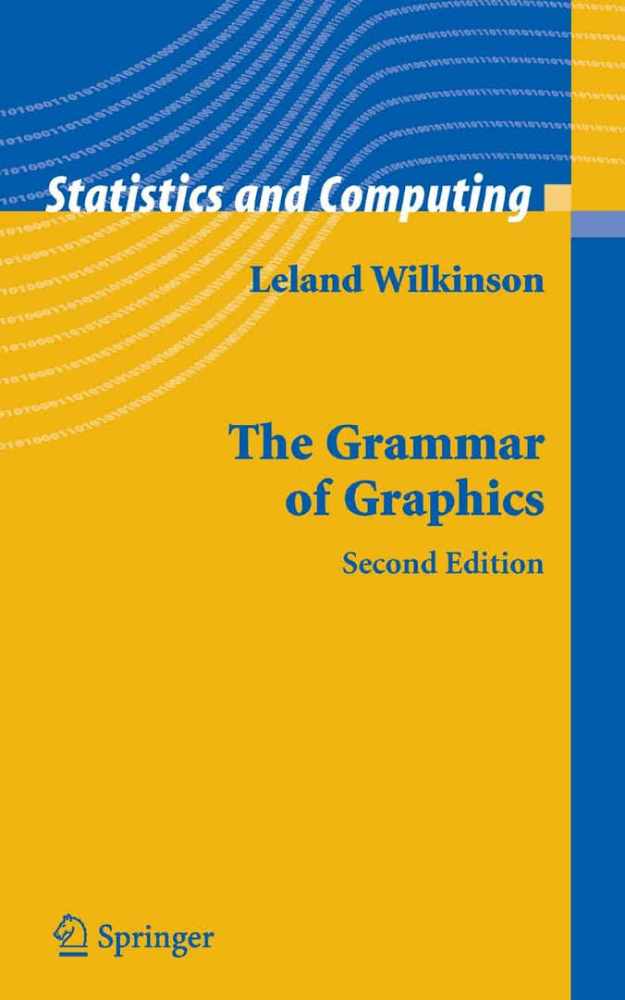

```{r setup, include=FALSE}
options(htmltools.dir.version = FALSE)
knitr::opts_chunk$set(comment = NA,fig.height=3, fig.width=5,dpi=300,message=FALSE)
```


# The Grammar of Graphics 

* 그래픽스 문법
* Leland Wilkinson(2005)
* Adjunctive Professor of Computer Science, University of Illinois at Chicago


```{r,out.width="230px",echo=FALSE}

knitr::include_graphics("https://www.cs.uic.edu/~wilkinson/lw.jpg")
```

---

# ggplot2

* 그래픽스문법에 따라 plot을 그리는 R 패키지
* Hadley Wickham(2009)
* Adjunctive Professor of Statistics at Rice University

```{r,out.width="230px",echo=FALSE}
knitr::include_graphics("http://t3.gstatic.com/images?q=tbn:ANd9GcSKy--Gph3gw4Si7_Zm2BXA6IuM5VVnpqySpJxGkAq4J9VoqhYl")
knitr::include_graphics("hadley.jpeg")
```

---

# R Graphics Cookbook

* ggplot2 예제 및 설명서
* Winston Chang(2012)
* software engineer at RStudio

```{r,out.width="230px",echo=FALSE}
knitr::include_graphics("http://t1.gstatic.com/images?q=tbn:ANd9GcR8STCvbSAFqj17eLn4x1uJYUQ2JDCQlH7Jn3fkz8JZLOux_G9v")
knitr::include_graphics("https://avatars0.githubusercontent.com/u/86978?s=400&v=4")
```


---

# Learn ggplot2 Using Shiny App

* Shiny app으로 ggplot2를 만들수 있는 책
* Keon-Woong Moon(2017)
* Professor of Cardiology at Catholic University of Korea

```{r,out.width="230px",echo=FALSE}
knitr::include_graphics("http://t1.gstatic.com/images?q=tbn:ANd9GcToLd_gUycJ2GboX6waGY1t6HgbhI4DAq87I7tXmHLo-SQ11Tb-")

```

---

# 필요한 패키지들

```{r,eval=FALSE}
install.packages(c("ggplot2","car","gcookbook","lattice"))
```
---
# 예제1

```{r,echo=FALSE,message=FALSE}
require(ggplot2)    # ggplot()을 사용하기 위해
require(car)        # Salaries 데이터를 사용하기 위해
theme_set(theme_gray(base_family="NanumGothic")) 

p <- ggplot(data=Salaries,                                # 데이터 할당
            aes(x=yrs.service,y=salary,fill=sex))  
p + geom_point(pch=21) +                                  # 점그래프
     geom_smooth(method="lm",formula=y~poly(x,2)) +       # 회귀선 추가
     facet_grid(~sex)                                     # 면을 수직으로 분할 
```

---

# 그래프의 구성

1. 데이터(data):

2. 좌표계(coordinate system):

3. 형태(geoms):

4. 미적 특징(aesthetics) :

5. 척도(scale):

6. 통계(stats):

7. 분할(facets)

---

* 데이터(data):
     + ggplot에서는 R의 데이터프레임(data.frame)만 사용 가능하다.

* 좌표계(coordinate system):
     + 좌표계는 데이터가 투영되는 2차원 공간을 말하는 것
     + 예를 들어 Cartesian 좌표계(디폴트), polar 좌표계, map projection 등이 있다.

* 형태(geoms):
     + data를 나타내는 기하학적인 형태
     + 예를 들어 점(point), 선(line), 면(area), 다각형(ploygon) 등이 있다.

* 미적 특징(aesthetics) :
     + 데이터의 시각적 특징을 나타내는 것
     + 예를 들어 위치, 크기, 색, 투명도 등이 있다.

--- 
---

* 척도(scale):
     + 데이터의 미적 특징을 수치화하는 척도
     + 예를 들어 로그척도, 색척도, 크기척도 등이 있다.

* 통계(stats):
     + 데이터의 요약에 사용되는 통계학적인 변형
     + 예를 들어 개수, 평균, 중앙값, 회귀선 등이 있다.

* 분할(facets)
     + 데이터를 여러 개의 부분집합으로 나누고 작은 여러 개의 그래프로 분할하여 그리는 것

---
### 그래프를 그리는 순서

1. 데이타 할당(data):
     + 데이타 프레임만 가능, 예: data=Salaries
2. 변수 할당 또는 설정(aes)
     + x축 변수: 반드시 필요하다.
     + y축 변수: 경우에 따라 필요하다(히스토그램, 밀도 곡선 등은 x축 변수만 지정하여 그릴 수 있으며 산점도 등에는 x축 변수와 함께 y축 변수가 필요하다).
     + colour, fill, size 등에도 변수를 할당(예: colour = sex)하거나 설정(예: colour = “black”)할 수도 있다.
     + 영국식 철자 사용
3. 형태 설정(geom):
     + 점(point), 선(line), 면(area), 다각형(ploygon) 등
     + 여러 형태를 layer by layer로 선택할 수 있다.
4. 기타 :
     + 좌표계와 척도 등은 기본값이 있으므로 따로 변경할 필요가 있는 경우를 제외하고는 설정해주지 않아도 그래프를 그릴 수 있다.
     + 필요에 따라 좌표계/척도의 설정을 변경, 통계 추가,면 분할 등을 추가


---

# 첫번째 예

### Salaries 데이터

```{r}
require(ggplot2)    # ggplot()을 사용하기 위해
require(car)        # Salaries 데이터를 사용하기 위해

str(Salaries)       # Salaries 데이터의 구조는? 
?Salaries           # 도움말 보기 
```

---
### 데이터 할당

```{r}
ggplot(data=Salaries)                           # 데이터 할당
```
---
### 데이터 및 x축 변수 할당

```{r}
ggplot(data=Salaries,                                # 데이터 할당
            aes(x=yrs.service))                      # 변수 할당
```
---

### 데이터 및 x축, y축변수 할당

```{r}
ggplot(data=Salaries,                                # 데이터 할당
            aes(x=yrs.service,y=salary))             # 변수 할당
```

---

###  점그래프 추가
```{r}
p <- ggplot(data=Salaries,                                # 데이터 할당
            aes(x=yrs.service,y=salary))                  # 변수 할당
p + geom_point()
```

---

###  성별에 따른 색깔구분 
```{r}
p + geom_point(aes(colour=sex))           # 점그래프의 색에 성별을 할당
```

---

### 통계추가 : loess회귀선 추가

```{r}
p + geom_point(aes(colour=sex)) +         # 점그래프의 색에 성별을 할당
     geom_smooth()                        # 회귀선 추가
```

---

### 면분할 : 성별로 면분할 

```{r}
p + geom_point(aes(colour=sex)) +         # 점그래프의 색에 성별을 할당
     geom_smooth() +                      # 회귀선 추가
     facet_grid(~sex)                     # 면을 수직으로 분할 
```

---

```{r}
p <- ggplot(data=Salaries,                          # 데이터 할당
            aes(x=yrs.service,y=salary,fill=sex))   # 변수할당
p + geom_point(pch=21) +                            # 점그래프
     geom_smooth(method="lm",formula=y~poly(x,2)) + # 회귀선 추가
     facet_grid(~sex)                               # 면을 수직으로 분할 
```

---


### 점의 형태

```{r,eval=FALSE}
x=0:48 
pch=c(0:25,65:73,91:104) 
shape=factor(pch) 
mypoints=data.frame(x=x,pch=pch,shape=shape)
ggplot(data=mypoints,aes(x=floor(x/7),y=x%%7))+
     geom_point(aes(shape=shape),size=4,color="red")+ 
     scale_shape_manual(values=pch)+ 
     geom_text(label=pch,vjust=-1.1,size=4)+
     theme(legend.position="none")+
     labs(title="Demonstration of point shape",x="",y="")+
     scale_y_reverse()+ 
     expand_limits(y=-0.2,ymax=6.2)
```

---

```{r,fig.height=4,fig.width=4,echo=FALSE,out.width="600px",out.height="600px"}
x=0:48 
pch=c(0:25,65:73,91:104) 
shape=factor(pch) 
mypoints=data.frame(x=x,pch=pch,shape=shape)
ggplot(data=mypoints,aes(x=floor(x/7),y=x%%7))+
     geom_point(aes(shape=shape),size=4,color="red")+ 
     scale_shape_manual(values=pch)+ 
     geom_text(label=pch,vjust=-1.1,size=4)+
     theme(legend.position="none")+
     labs(title="Demonstration of point shape",x="",y="")+
     scale_y_reverse()+ 
     expand_limits(y=-0.2,ymax=6.2)
```
---

### 예제 2 : 대학교수 직급별 연봉분포

```{r,echo=FALSE}
ggplot(data=Salaries,aes(x=salary,fill=rank)) + # 데이타, 변수 할당
geom_density(alpha=0.4)         # density 추가, 투명도 조절 
```

---

### 대학교수의 연봉분포 

```{r}
p<-ggplot(data=Salaries,aes(x=salary)) # 데이타, 변수 할당
p+ geom_density()         # density 추가, 투명도 조절 
```
---

### 대학교수의 직급별 연봉분포 

```{r}
p<-ggplot(data=Salaries,aes(x=salary,fill=rank)) # 데이타, 변수 할당
p+ geom_density()         # density 추가, 투명도 조절 
```

---
### 투명도, 선굵기 조절

```{r}
ggplot(data=Salaries,aes(x=salary,fill=rank)) + # 데이타, 변수 할당
geom_density(alpha=0.4,size=0.2)         # density 추가, 투명도 조절 
```

---
### 가수의 키 분포

* 사용데이터 lattice::singer
```{r,echo=FALSE}
ggplot(data=lattice::singer,aes(x=height,fill=voice.part))+ 
     geom_density()+ 
     facet_grid(voice.part ~ .)+ 
     labs(title="Singer's Height")
```

---

```{r}
str(lattice::singer)
```
```{r,eval=FALSE}
ggplot(data=lattice::singer,aes(x=height,fill=voice.part))+ 
     geom_density()+ 
     facet_grid(voice.part ~ .)+ 
     labs(title="Singer's Height")
```

---

### Area Plot

* 사용데이터 gcookbook::uspopage
```{r,echo=FALSE}
require(gcookbook)
ggplot(uspopage,aes(x=Year,y=Thousands,fill=AgeGroup))+ 
     geom_area(size=0.2,alpha=0.4) +
     geom_line(position='stack',size=0.2)+ 
     scale_fill_brewer(palette="Blues")
```

---

### 3-1 점그래프
```{r}
require(gcookbook)
ggplot(uspopage,aes(x=Year,y=Thousands,color=AgeGroup))+
     geom_point()
```
---

### 3-2 점그래프 위치변경

```{r}
ggplot(uspopage,aes(x=Year,y=Thousands,color=AgeGroup))+
     geom_point(position=position_stack())
```

---
### 3-3 점그래프 + 선그래프

```{r}
ggplot(uspopage,aes(x=Year,y=Thousands,color=AgeGroup))+
     geom_point(position=position_stack())+
     geom_line()
```

---
### 3-4 점그래프 + 선그래프 위치변경

```{r}
ggplot(uspopage,aes(x=Year,y=Thousands,color=AgeGroup))+
     geom_point(position=position_stack())+
     geom_line(position=position_stack())
```

--- 
---

### 3-5 영역그래프

```{r}
p <- ggplot(uspopage,aes(x=Year,y=Thousands,fill=AgeGroup))
p +  geom_area() 
```

---

### 3-6 투명도 조절 + 선추가 
```{r}
p +  geom_area(alpha=0.4) +
     geom_line(position='stack',size=0.2)
```

---

### 3-7 팔레트적용
```{r}
p +  geom_area(alpha=0.4) +
     geom_line(position='stack',size=0.2) +
     scale_fill_brewer(palette="Blues")
```

---
.pull-left[
### R 에서 팔레트 사용
```{r,fig.height=7,eval=FALSE}
library(RColorBrewer) 
display.brewer.all()
```
]
.pull-right[

```{r,fig.height=9,echo=FALSE}
library(RColorBrewer) 
display.brewer.all()
```
]

---

### 예제 4: 직급별 연봉

```{r, echo=FALSE}
ggplot(data=Salaries,aes(x=rank,y=salary,fill=rank))+ 
     geom_violin(trim=FALSE)+ 
     geom_boxplot(fill='darkred',width=0.1)+ 
     stat_summary(geom='point',fun.y=mean,shape=23,size=3)+ 
     geom_point(position='jitter',size=0.5)+ 
     scale_fill_brewer(palette='Pastel2')+ 
     theme(legend.position='none')
```
---

```{r, eval=FALSE}
ggplot(data=Salaries,aes(x=rank,y=salary,fill=rank))+ 
     geom_violin(trim=FALSE)+ 
     geom_boxplot(fill='darkred',width=0.1)+ 
     stat_summary(geom='point',fun.y=mean,shape=23,size=3)+ 
     geom_point(position='jitter',size=0.5)+ 
     scale_fill_brewer(palette='Pastel2')+ 
     theme(legend.position='none')
```
---

###  예제 5. 막대그래프

.pull-left[
```{r,echo=FALSE}
ggplot(data=Salaries, aes(x=sex,fill=rank))+
      geom_bar()
ggplot(data=Salaries, aes(x=sex,fill=rank))+
      geom_bar(position="fill")
```      
]

.pull-right[
```{r,echo=FALSE}
ggplot(data=Salaries, aes(x=sex,fill=rank))+
      geom_bar(position="dodge")
```
]
---

###  막대의 위치

.pull-left[

####  position = "fill"
```{r}
ggplot(data=Salaries, 
       aes(x=sex,fill=rank))+
      geom_bar(position="fill")

```      
]

.pull-right[
####  position = "dodge"
```{r}
ggplot(data=Salaries, 
       aes(x=sex,fill=rank))+
      geom_bar(position="dodge")
```
]

---

### 예제 6  클리브랜드 dot plot

```{r,echo=FALSE}
tophit=tophitters2001[1:25,] 

ggplot(data=tophit,aes(x=avg,y=reorder(name,avg),colour=lg))+ 
geom_segment(aes(xend=0.31,yend=name))+ geom_point(size=3)+
facet_grid(lg ~ .,scales= "free_y" ,space= "free_y" )+ theme_bw()+
theme(legend.position= "none" )+ ylab("")
```

---

* 사용데이터 gcookbook::tophitters2001

```{r}
tophit=tophitters2001[1:25,] 
str(tophit)
```

---
### 산점도
```{r}
ggplot(data=tophit,aes(x=avg,y=name,colour=lg))+ 
       geom_point()
```
---

### 이름을 성적순으로
```{r}
p <- ggplot(data=tophit,aes(x=avg,y=reorder(name,avg),colour=lg)) 
p +  geom_point()
```

---
### 산점도+선분추가

```{r}
p + geom_point() +
     geom_segment(aes(xend=0.31,yend=name))
```
---
###  산점도+선분추가+테마 적용

```{r}
p + geom_point() +
     geom_segment(aes(xend=0.31,yend=name)) +
     theme_bw()
```

---

### 면분할 
```{r}
p + geom_point() +
     geom_segment(aes(xend=0.31,yend=name)) + 
     theme_bw() +
     facet_grid(lg~.)
```

---
### 면분할 옵션조절
```{r}
p + geom_point() +
     geom_segment(aes(xend=0.31,yend=name)) + 
     theme_bw() +
     facet_grid(lg~.,scales= "free_y",space= "free_y" )
```
---
### 그래프 가다듬기
```{r}
p + geom_point() +
     geom_segment(aes(xend=0.31,yend=name)) + 
     theme_bw() +
     facet_grid(lg~.,scales= "free_y",space= "free_y" ) +
     theme(legend.position= "none" )+ ylab("")
```

---
# R package ggplotAssist

* ggplot2를 배울수 있는 shiny app
* Keon-Woong Moon(2017)
* Professor of Cardiology at Catholic University of Korea

```{r,eval=FALSE}
install.packages("ggplotAssist")
```

https://github.com/cardiomoon/ggplotAssist
---
* 데이터 ggplot2::msleep
```{r,echo=FALSE,warning=FALSE}
ggplot(msleep,aes(x=bodywt,y=brainwt))+
	geom_point()+
	scale_x_log10(breaks=scales::trans_breaks('log10', function(x) 10^x),labels=scales::math_format(10^.x))+
	scale_y_log10(breaks=scales::trans_breaks('log10', function(x) 10^x),labels=scales::math_format(10^.x))+
	theme_bw()+
	annotation_logticks(side='tblr')+
	theme(panel.grid.minor=element_blank())
```

---
```{r,eval=FALSE}
ggplot(msleep,aes(x=bodywt,y=brainwt))+
	geom_point()+
	scale_x_log10(breaks=scales::trans_breaks('log10', function(x) 10^x),labels=scales::math_format(10^.x))+
	scale_y_log10(breaks=scales::trans_breaks('log10', function(x) 10^x),labels=scales::math_format(10^.x))+
	theme_bw()+
	annotation_logticks(side='tblr')+
	theme(panel.grid.minor=element_blank())
```

---
# R package ggiraphExtra

* For interactive plot
* Keon-Woong Moon(2017)

```{r,eval=FALSE}
install.packages("ggiraphExtra")
```

https://github.com/cardiomoon/ggiraphExtra
http://rpubs.com/cardiomoon/231820